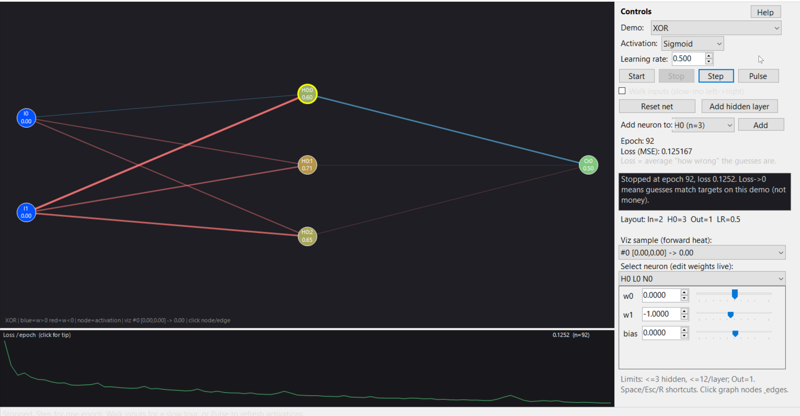

# PSNeuron

Educational feed-forward neural network in **PowerShell**, with a WinForms teaching GUI so you can see weights, activations, loss, and a slow-walk of inputs through the net.

Built for learning — XOR and sine one-step forecast demos, live weight editing, multi-hidden topology, and plain-English tips.

## Screenshot



## Requirements

- PowerShell 7+ (`pwsh`) — the module uses the ternary operator
- Windows (WinForms GUI)

## Quick start

```powershell
git clone https://github.com/joeymiles/PSNeuron.git
cd PSNeuron
pwsh -STA -File .\PSNeuron-GUI\Start-PSNeuronGUI.ps1
```

Smoke test (no window):

```powershell
pwsh -STA -File .\PSNeuron-GUI\Start-PSNeuronGUI.ps1 -SmokeTest
```

## Layout

| Path | Purpose |
|------|---------|
| `PSNeuron.psm1` | Core `Neuron` / `NeuralNetwork` module |
| `PSNeuron-GUI/` | Educational WinForms UI + adapter |

## Features

- Start / Stop / Step epoch / Reset
- Demo picker: XOR or sine forecast
- Activation + learning-rate controls
- Click nodes/edges, walk inputs, hover tips, loss strip
- Add hidden neurons/layers with weight transplant

## License

MIT
